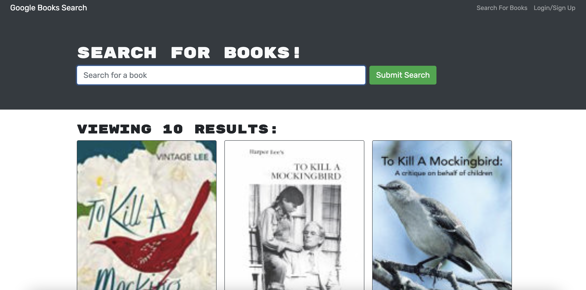

# Book Search Engine

A book search engine where users can look for books, sign in, and save their favorite books. Ran by the Google Books API, built with the MERN stack. 

## User Story
```md
AS AN avid reader
I WANT to search for new books to read
SO THAT I can keep a list of books to purchase
```

## Screenshot and Deployed Link

[Deployed link](https://salty-sands-83211.herokuapp.com/)

## Languages and Tools Used
* 
* 
* 
* 
* 
* 
* 
* 
* 
* 

## Credits
Pengteda Cheng 
* [](https://github.com/teedaa)
* [](https://linkedin.com/in/pengteda-cheng)
* [Markdown Badges](https://github.com/Ileriayo/markdown-badges)